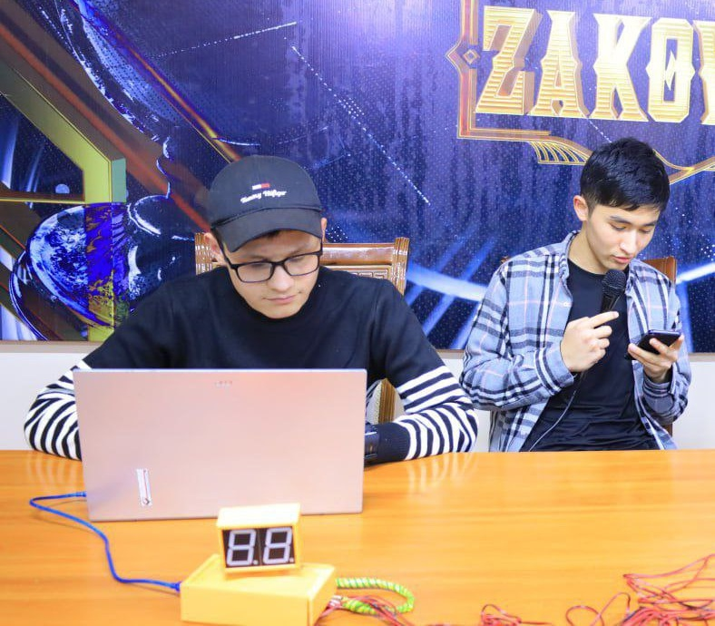
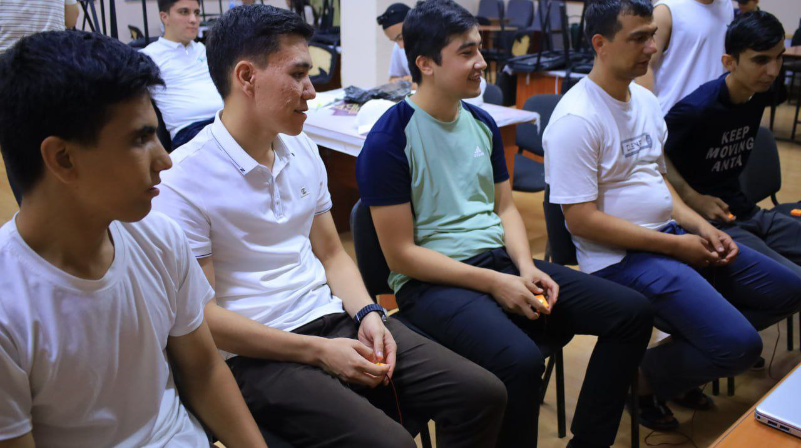
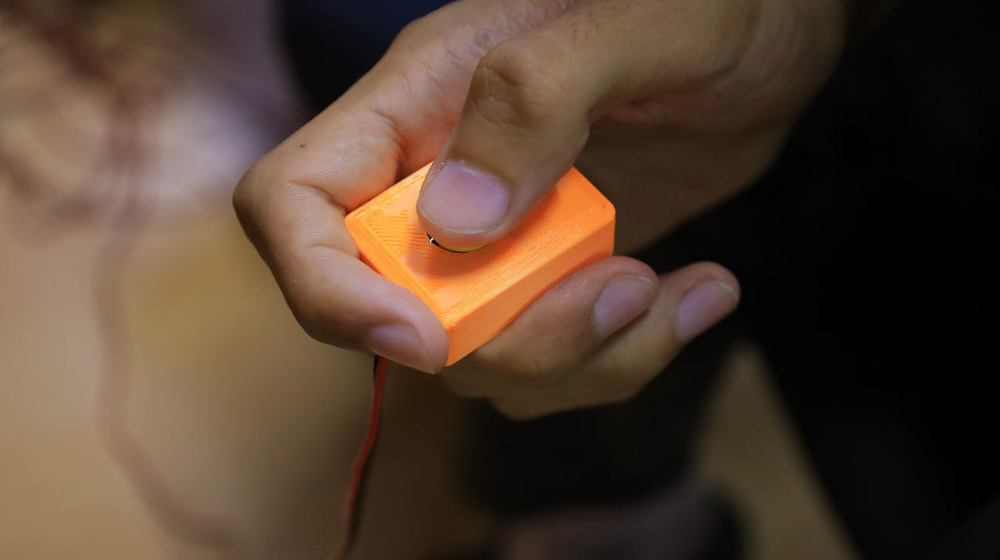

# Arduino Quiz Buzzer System - Build Instructions

A DIY quiz buzzer system for games like **Svoyak** (Jeopardy-style) and **Brain Ring**. Supports up to 6 players/teams with countdown timer display and audio feedback.

---

## Parts List

### Electronics
| Component | Quantity | Notes |
|-----------|----------|-------|
| Arduino Mega 2560 R3 | 1 | Must be Mega (uses pins 22-37) |
| 1.8" 7-Segment Display (Common Cathode) | 2 | Single digit, 10-pin |
| Push Button | 6 | Any momentary switch |
| Active Buzzer | 1 | 5V, uses HIGH/LOW signal |
| 220Ω Resistor | 14 | One per display segment |
| Jumper Wires | ~40 | Male-to-male and male-to-female |
| USB Cable (Type-B) | 1 | For Arduino programming/power |

> [!WARNING]
> **Display Size & Power Consumption:**  
> Displays larger than 1.8" may require external power supply. Arduino Mega has a 500mA current limit via USB.
>
> **Current Calculation (with 220Ω resistors):**
> - LED forward voltage: ~2V
> - Supply voltage: 5V
> - Current per segment: (5V - 2V) / 220Ω = **~13.6mA**
> - Display 1 worst case (digit "8" + dot = 8 segments): 8 × 13.6mA = **~109mA**
> - Display 2 worst case (digit "8", no dot = 7 segments): 7 × 13.6mA = **~95mA**
> - Two displays worst case: 109 + 95 = **~204mA**
> - **Total estimated: ~204mA** (already exceeding 200mA limit)
>
> Larger displays have higher current draw per segment. If using bigger displays, consider:
> - Using higher value resistors (reduces brightness)
> - Powering displays from external 5V supply with common GND

### 3D Printed Parts
| File | Description | Quantity |
|------|-------------|----------|
| `controller_case.stl` | Main Arduino enclosure | 1 |
| `controller_case_lid.stl` | Lid for controller | 1 |
| `display_case.stl` | Housing for displays | 1 |
| `display_case_lid.stl` | Lid for display housing | 1 |
| `display_stand.stl` | Stand for display case | 1 |
| `button_case_bottom.stl` | Player button base | 6 |
| `button_case_top.stl` | Player button top | 6 |

### Tools Needed
- Wire strippers / scissors
- 3D printer (or printing service)
- Zip ties (for cable management)
- Screwdriver

> [!TIP]
> Soldering is not required! Controller case has sockets to mount your wires using zip ties.

---

### Pin Reference Table

#### Buttons (use internal pullup - connect button between pin and GND)
| Button | Arduino Pin |
|--------|-------------|
| Player 1 | D2 |
| Player 2 | D3 |
| Player 3 | D4 |
| Player 4 | D5 |
| Player 5 | D7 |
| Player 6 | D8 |

#### Buzzer
| Component | Arduino Pin |
|-----------|-------------|
| Buzzer (+) | D6 |
| Buzzer (-) | GND |

#### Display 1 (Seconds/Main digit) - via 220Ω resistors
| Segment | Arduino Pin |
|---------|-------------|
| A | 22 |
| B | 23 |
| C | 24 |
| D | 25 |
| E | 26 |
| F | 27 |
| G | 28 |
| DP (dot) | 29 |
| Common Cathode | GND |

#### Display 2 (Tenths digit) - via 220Ω resistors
| Segment | Arduino Pin |
|---------|-------------|
| A | 30 |
| B | 31 |
| C | 32 |
| D | 33 |
| E | 34 |
| F | 35 |
| G | 36 |
| DP (dot) | 37 |
| Common Cathode | GND |

---

## Assembly Steps

### Step 1: Prepare Wires
1. Gather jumper wires (male-to-male and male-to-female)
2. For buttons: prepare 2-wire cables (signal + GND) long enough to reach player positions
3. For displays: you'll need 9 wires per display (7 segments + dot + common cathode)

### Step 2: Prepare Resistors
1. Insert a 220Ω resistor inline with each segment wire (A-G and DP) for both displays
2. Use breadboard or twist resistor legs around wire ends, then cover with electrical tape
3. This limits current to ~13mA per segment, protecting the Arduino

> [!TIP]
> Alternatively, buy pre-made resistor jumper wires or use a small breadboard to connect resistors.

### Step 3: Wire the Displays
1. Connect Arduino pins 22-28 → resistors → Display 1 segments A-G
2. Connect Arduino pin 29 → Display 1 dot pin
3. Connect Arduino pins 30-36 → resistors → Display 2 segments A-G
4. Connect Arduino pin 37 → Display 2 dot pin
5. Connect both displays' common cathode pins to Arduino GND
6. Test with a simple sketch before continuing

### Step 4: Wire the Buttons
1. Connect one leg of each button to its designated Arduino pin
2. Connect the other leg to GND
3. The code uses internal pullup resistors, so no external resistors needed

### Step 5: Wire the Buzzer
1. Connect buzzer (+) to pin D6
2. Connect buzzer (-) to GND

### Step 6: Print & Assemble Cases
1. Print all STL files (recommended: PLA, 0.2mm layer height, 20% infill)
2. Install Arduino in `controller_case.stl`
3. Route wires through the case openings
4. Use zip ties in mounting sections to secure cables
5. Attach lid with `controller_case_lid.stl`
6. Mount displays in `display_case.stl`, add stand
7. Install buttons in `button_case_bottom.stl` + `button_case_top.stl`

### Step 7: Upload Code
1. Open Arduino IDE
2. Connect Arduino via USB
3. Open `svoyak.ino` or `brainring.ino`
4. Select **Board: Arduino Mega 2560** and correct COM port
5. Click Upload

---

## Usage

### Serial Commands
| Command | Action |
|---------|--------|
| `R` | Start new session (reset all) |
| `T` | Start countdown timer |
| `C` | Continue (Svoyak only) |

### Game Modes

**Svoyak (7-second timer):**
- Each player plays individually
- Press button to buzz in and stop timer
- Display shows player number + "P"

**Brain Ring (20-second timer):**
- Teams compete
- False start detection (shows player + "F")
- Pressing before timer starts = false start logged

### Display Indicators
- `X.P` = Player X pressed (valid)
- `X.F` = Player X false start
- `X.X` = Countdown timer (seconds.tenths)

---

## Troubleshooting

| Problem | Solution |
|---------|----------|
| Display shows nothing | Check common cathode is grounded, verify resistor connections |
| Segments are dim | Resistor value too high, try 180Ω |
| Button not detected | Check button wiring, ensure GND connection |
| Buzzer silent | Verify it's an active buzzer, check polarity |
| Wrong player number shown | Verify button pin assignments match code |

---

## Files Location
- **Arduino Code:** `Arduino/svoyak/` and `Arduino/brainring/`
- **3D Models:** `3ds Max 2026/export/`

---

## Images

### Real Game Usage

*Operator station with the controller unit and 7-segment display during a Zakovat game*

*Players holding the 3D printed buzzer buttons, ready to compete*

*Close-up of the 3D printed buzzer button in hand*
